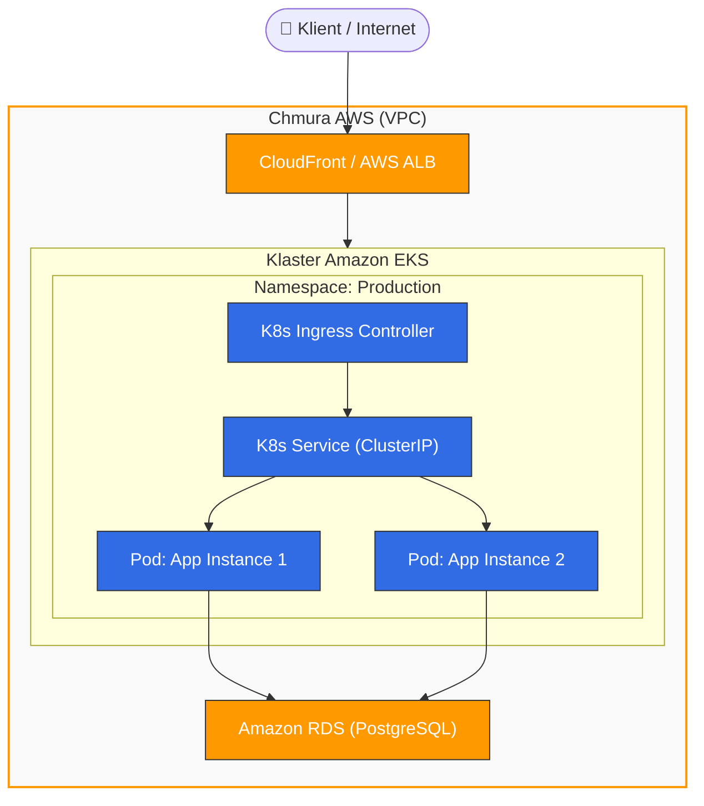

Without Istio - Classical Ingress: `AWS:ELB ---> [ Service:LoadBalancer ---> Nginx-Pod (Engine) --(reads Ingress rules)--> Service:ClusterIP ---> SomePod ]`

With Istio: `AWS:ELB ---> [ Service:LoadBalancer ---> istio-ingressgateway-Pod (Engine) --(configured by Gateway & VirtualService)--> SomePod ]`

CNI (K8S docs: Topics > Extensions)

