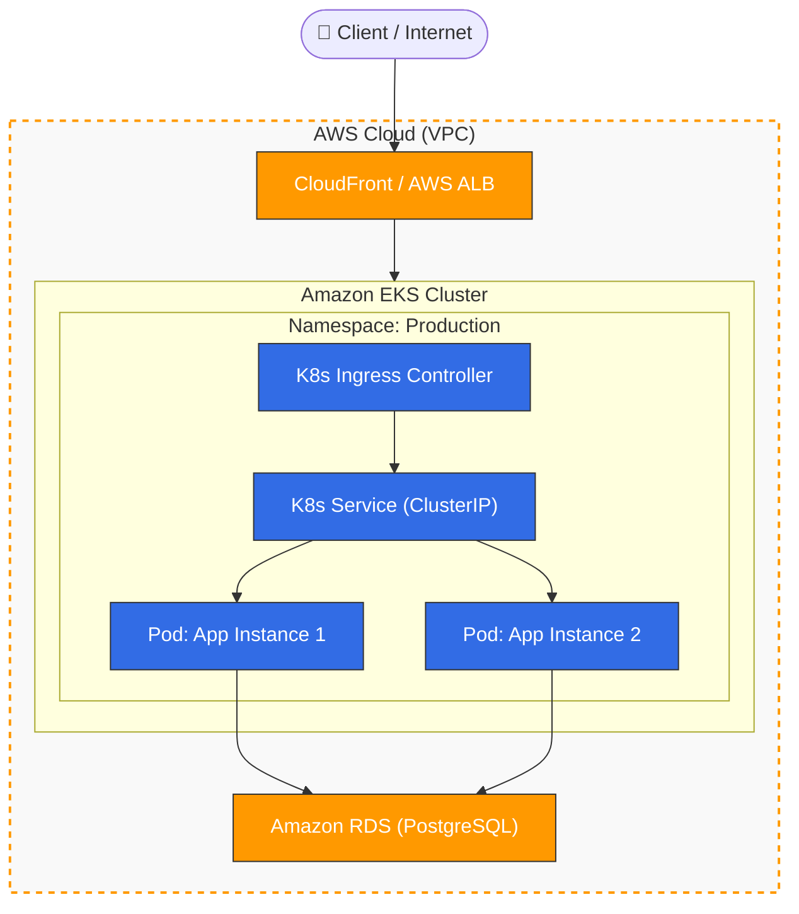

# Remaining topics

## Ingress Traffic Routing Architecture Comparison
The architectural path of an external request into a Kubernetes cluster varies significantly based on the chosen routing engine. 

In a classical Ingress pattern, traffic hits the cloud load balancer (**AWS ELB**), passes through a `LoadBalancer` service to reach an **Nginx Ingress Pod**, which evaluates routing rules locally before forwarding the request to a backend `ClusterIP` service and its target pods. 

By adopting a service mesh like **Istio**, the architecture is flattened: the cloud load balancer routes traffic straight to the `istio-ingressgateway` Pod, which leverages `Gateway` and `VirtualService` CRDs to bypass standard kube-proxy hop mechanisms and proxy requests directly to application pods. When integrated deeply with cloud-native ingress controllers (such as the **AWS Load Balancer Controller**), the intermediate routing layers are optimized entirely; the cloud **ALB/NLB** leverages the cluster's **Container Network Interface (CNI)** to map traffic directly to individual Pod IP addresses, bridging external cloud infrastructure and private cluster workloads seamlessly while securely delegating external state to managed services like **Amazon RDS**.

Sum up:
- Without Istio - Classical Ingress: `AWS:ELB ---> [ Service:LoadBalancer ---> Nginx-Pod (Engine) --(reads Ingress rules)--> Service:ClusterIP ---> SomePod ]`
- With Istio: `AWS:ELB ---> [ Service:LoadBalancer ---> istio-ingressgateway-Pod (Engine) --(configured by Gateway & VirtualService)--> SomePod ]`

Diagram:

```mermaid
graph TD
    %% Style Definitions
    classDef aws color:#fff,fill:#FF9900,stroke:#333,stroke-width:1px;
    classDef k8s color:#fff,fill:#326CE5,stroke:#333,stroke-width:1px;
    classDef net color:#222,fill:#E6F2F7,stroke:#0073BB,stroke-width:2px;

    User([👤 Client / Internet]) --> ALB["CloudFront / AWS ALB"]:::aws

    subgraph AWS_VPC ["AWS Cloud (VPC)"]
        ALB --> EKS_Cluster
        
        subgraph EKS_Cluster ["Amazon EKS Cluster"]
            direction LR
            
            subgraph K8s_Ingress ["Namespace: Production"]
                Ingress["K8s Ingress Controller"]:::k8s
                Service["K8s Service (ClusterIP)"]:::k8s
                Pod1["Pod: App Instance 1"]:::k8s
                Pod2["Pod: App Instance 2"]:::k8s
                
                Ingress --> Service
                Service --> Pod1
                Service --> Pod2
            end
        end
        
        %% External cloud managed database routing
        Pod1 --> RDS["Amazon RDS (PostgreSQL)"]:::aws
        Pod2 --> RDS
    end

    %% External boundary container styling
    style AWS_VPC fill:#f9f9f9,stroke:#FF9900,stroke-width:2px,stroke-dasharray: 5 5
```